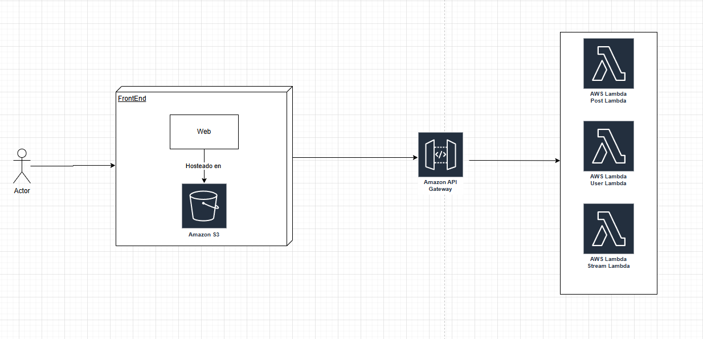

# Lab-07-AREP

##  Resumen del proyecto

Es una aplicación web tipo Twitter que permite a los usuarios crear y visualizar publicaciones de hasta **140 caracteres** en un flujo (stream) público compartido.  
El proyecto fue desarrollado inicialmente como un **monolito con Spring Boot**, para luego evolucionar hacia una **arquitectura basada en microservicios con AWS Lambda**.

Además, se incluye un **frontend en JavaScript** desplegado en **Amazon S3**, con autenticación y seguridad basada en **JWT (JSON Web Tokens)** usando **AWS Cognito**.

---

##  Arquitectura del sistema

El sistema fue diseñado con tres fases evolutivas:

### Monolito Spring Boot
El monolito maneja toda la lógica de negocio y persistencia en una sola aplicación.

#### Entidades principales
- **Usuario**: contiene el nombre, username, email y credenciales del usuario.
- **Post**: representa una publicación de máximo 140 caracteres.
- **Stream**: flujo público donde se registran los posts creados por los usuarios.

#### Endpoints principales
| Método            | Endpoint | Descripción |
|-------------------|-----------|--------------|
| `POST             |/users` | Crea un nuevo usuario |
| `POST             |/posts` | Crea un nuevo post (máx. 140 caracteres) |
| `GET              |/posts` | Obtiene todos los posts del stream |
| `GET |/users/{id}` | Consulta información de un usuario |

### Implementado en AWS

#### Componentes principales

| Servicio            | Uso                             |
| ------------------- | ------------------------------- |
| **AWS EC2**         | Despliegue inicial del monolito |
| **AWS S3**          | Hosting del frontend            |
| **AWS Cognito**     | Autenticación JWT               |
| **AWS Lambda**      | Microservicios backend          |
| **AWS API Gateway** | Enrutamiento de las Lambdas     | 

#### Seguridad

-   Autenticación JWT con AWS Cognito

-   CORS configurado solo para dominios válidos

-   HTTPS habilitado en S3 y API Gateway

-   Validación de tokens en cada endpoint protegido

-   Roles IAM específicos para Lambdas (principio de mínimo privilegio)

## Video

## Built With

* [Java](https://www.java.com/es) - Lenguaje para el backend
* [Maven](https://maven.apache.org/) - Manejo de Dependencias
* [Spring initializr](https://start.spring.io) - Crear el proyecto de Spring con dependencias
* [AWS](https://aws.amazon.com/es/free/?trk=90bc4346-f6a5-4430-b543-83e255b54666&sc_channel=ps&ef_id=CjwKCAjwobnGBhBNEiwAu2mpFGmYC_nqnz9GF7a-i-QbT3aLWvsfkpjY0XLhTyglvGtvzrK5R8fM7BoC29AQAvD_BwE:G:s&s_kwcid=AL!4422!3!647999754693!e!!g!!aws!19685286946!149715822407&gad_campaignid=19685286946&gclid=CjwKCAjwobnGBhBNEiwAu2mpFGmYC_nqnz9GF7a-i-QbT3aLWvsfkpjY0XLhTyglvGtvzrK5R8fM7BoC29AQAvD_BwE) - Plataforma de servicios de nube

## Authors

* **Santiago Córdoba Dueñas**  - [Santiago Córdoba](https://github.com/Santiago-Cordoba)
* **Santiago Coronado Pinzon** - [Santiago Coronado](https://github.com/Santiago12323)
* **Nicolas Prieto** - [Nicolas Prieto](https://github.com/NicolasPriVar)

## Acknowledgments

* Aprendizaje acerca del funcionamiento de los Lambda en AWS
* Refuerzo de los monolitos
* Aprendizaje de JWT.