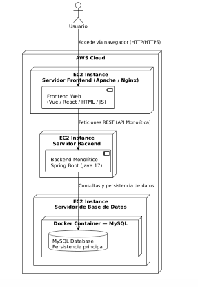
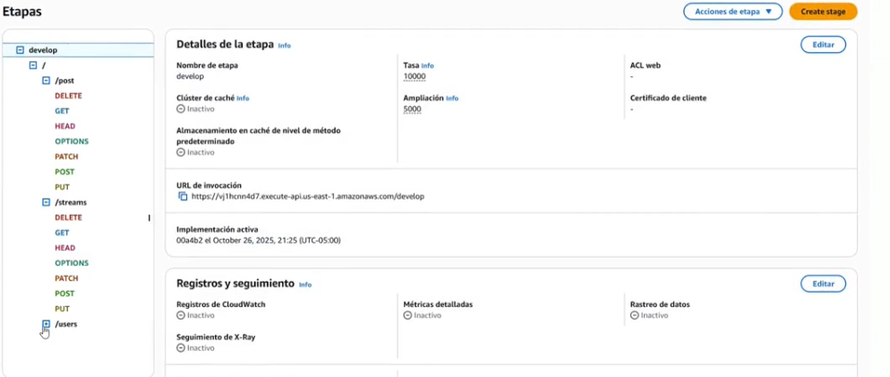
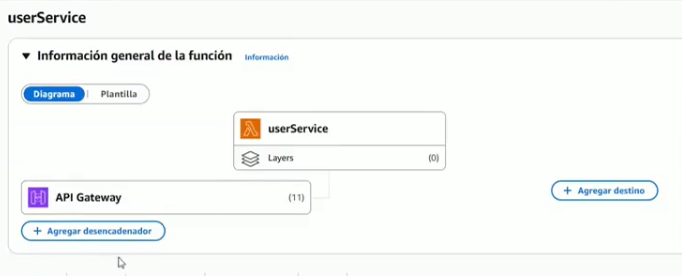
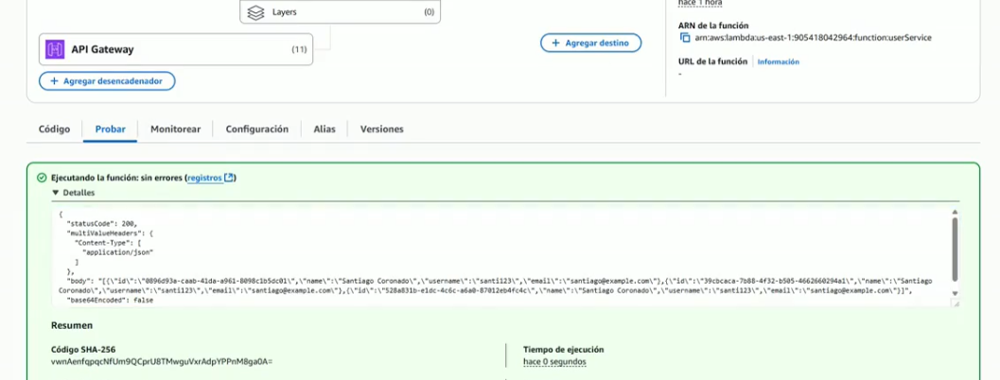
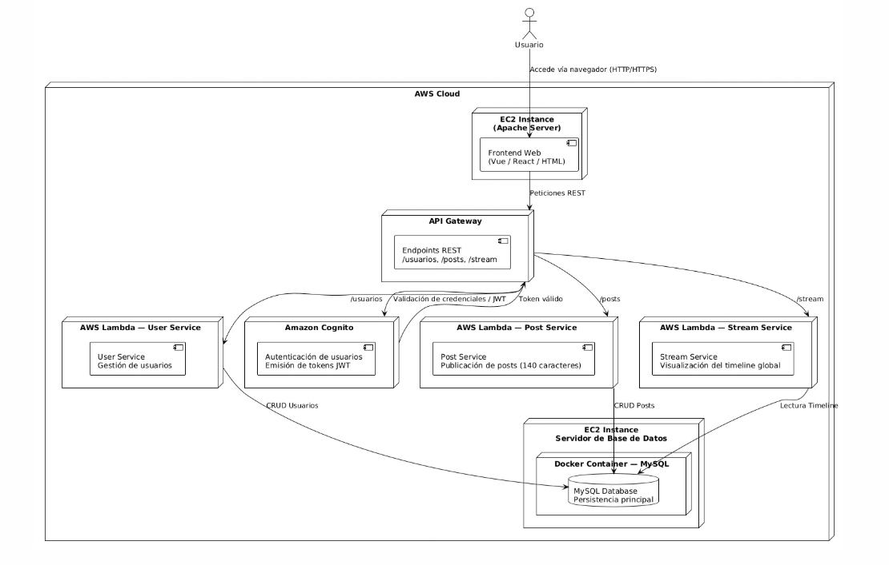

# Twitter Clone: De Monolito a Microservicios Serverless en AWS

## 1. Resumen del Proyecto

Este proyecto documenta la creación y evolución de una aplicación inspirada en Twitter. Nació como un prototipo monolítico simple y se transformó en una arquitectura de microservicios completamente serverless, desplegada en Amazon Web Services (AWS) y asegurada con JSON Web Tokens (JWT) a través de Amazon Cognito.

El objetivo principal era doble:
1.  Construir una API funcional para gestionar usuarios, posts y un stream de publicaciones.
2.  Adquirir experiencia práctica en la refactorización de una aplicación monolítica hacia una arquitectura de microservicios moderna, segura y escalable en la nube.

---

## 2. Tecnologías Principales

- **Lenguaje:** Java 17
- **Framework:** Spring Boot 3.2.5
- **Gestión de Dependencias:** Apache Maven
- **Base de Datos (Fase 1):** H2 In-Memory Database
- **Plataforma Cloud:** Amazon Web Services (AWS)
    - **Computación:** AWS Lambda
    - **API:** Amazon API Gateway
    - **Seguridad:** Amazon Cognito (para gestión de usuarios y JWT)
- **Dependencias Clave:**
    - `spring-boot-starter-web`
    - `spring-boot-starter-data-jpa`
    - `aws-lambda-java-core`
    - `aws-lambda-java-events`

---

## 3. Parte 1: El Prototipo Monolítico

## rama main

La primera fase del proyecto consistió en desarrollar una aplicación monolítica autocontenida para validar la lógica de negocio principal.

### 3.1. Arquitectura

- **Aplicación:** Una única aplicación Spring Boot que contenía toda la lógica de negocio, acceso a datos y exposición de la API.
- **Base de Datos:** Se utilizó una base de datos en memoria H2 para simplificar el desarrollo y las pruebas, permitiendo un arranque rápido sin dependencias externas.
- **Entidades Principales:**
    - `User`: Representa a los usuarios del sistema.
    - `Post`: Modela una publicación individual, limitada a 140 caracteres.
    - `Stream`: Agrega todas las publicaciones en un único flujo cronológico, similar al timeline principal de Twitter.

### 3.2. diagrama de arquitectura



### 3.3. Funcionalidad

Se desarrolló una API REST que permitía realizar operaciones CRUD básicas sobre las entidades, principalmente la creación de nuevos posts y su visualización en un stream unificado.

---

## 4. Parte 2: Evolución a Microservicios Serverless

## rama microservice

La segunda fase fue la refactorización del monolito hacia una arquitectura de microservicios serverless, desacoplada, escalable y segura.

### 4.1. Arquitectura

El monolito se descompuso en tres microservicios independientes, cada uno responsable de una única entidad:

- **Microservicio de Usuarios:** Gestiona todo lo relacionado con los usuarios.
- **Microservicio de Posts:** Se encarga de la creación y gestión de las publicaciones.
- **Microservicio de Stream:** Administra la visualización y agregación del stream de posts.

### 4.2. Despliegue y Orquestación en AWS

- **AWS Lambda:** Cada microservicio fue empaquetado y desplegado como una función AWS Lambda independiente. Esto elimina la necesidad de gestionar servidores, permitiendo que la aplicación escale automáticamente según la demanda.
- **Amazon API Gateway:** Se configuró un API Gateway para cada función Lambda, exponiendo endpoints HTTP seguros al mundo exterior. Esto actúa como la puerta de entrada para todas las peticiones a los microservicios.
# 🧠 Arquitectura Serverless + EC2 — Despliegue de Microservicios Spring Boot en AWS

## 🏗️ Componentes Principales
- **AWS Cognito** → Autenticación y autorización de usuarios (JWT).
- **AWS API Gateway** → Exposición y enrutamiento de endpoints REST.
- **AWS Lambda (por microservicio)** → Funciones con `LambdaHandler`.
- **EC2 Frontend (Apache + Vue/React)** → Servidor web.
- **EC2 Base de Datos (Docker + MySQL)** → Persistencia.
- **IAM Roles** → Permisos entre servicios.

---

## ⚙️ 1. Configuración de AWS Cognito
1. Crear un **User Pool**.
2. Crear un **App Client** sin secreto.
3. Activar flujos de autenticación con JWT.
4. Obtener `UserPoolId` y `AppClientId`.
5. Usar Cognito como **Authorizer** en API Gateway.

---




## 🚪 2. Creación de Microservicios en Lambda
1. Empaquetar con Maven:
   ```bash
   mvn clean package
   ```
Asignar rol IAM con acceso a CloudWatch y RDS/EC2.

Repetir por microservicio.

## 🌐 3. Configuración de API Gateway

Crear REST API.

Definir recursos y métodos:

   ```bash
      /user → Lambda: userService
      /post → Lambda: postService
      /feed → Lambda: feedService
   ```





Integrar con Lambda.

Añadir Cognito Authorizer.

Habilitar CORS.

Desplegar API y obtener Invoke URL.

## 🗄️ 4. Base de Datos Dockerizada en EC2

Crear instancia EC2 (Linux/Ubuntu).

Instalar Docker:

   ```bash
    sudo apt update && sudo apt install docker.io -y
   ```
Ejecutar contenedor MySQL:
   ```bash
    sudo docker run --name mysql-container -e MYSQL_ROOT_PASSWORD=admin123 -p 3306:3306 -d mysql:8.0
   ```
Crear base de datos twitter_clone.

Configurar conexión en application.properties con la IP de EC2.


## 💻 5. Despliegue del Frontend (EC2 con Apache)

Crear instancia EC2 para el frontend.

Instalar Apache:

   ```bash
    sudo apt update && sudo apt install apache2 -y

   ```
## 🔒 6 Certificado SSL Gratuito con Let's Encrypt

Instalar Certbot:
   ```bash

sudo apt install certbot python3-certbot-apache -y
   ```

Generar certificado SSL:


   ```bash
sudo certbot --apache -d twitterclone.duckdns.org
   ```


Verificar instalación:

   ```bash

sudo systemctl status apache2
   ```

Configurar renovación automática:

   ```bash

sudo certbot renew --dry-run
   ```

### 4.3. Implementación de Seguridad con Cognito y JWT

Para asegurar la arquitectura, se integró Amazon Cognito:

1.  **Gestión de Usuarios:** Cognito se utilizó como un proveedor de identidad para registrar y autenticar a los usuarios.
2.  **Autenticación JWT:** Tras un inicio de sesión exitoso, Cognito emite un JSON Web Token (JWT) al cliente.
3.  **Autorización en API Gateway:** El API Gateway fue configurado para actuar como un autorizador, validando el JWT en cada petición entrante antes de invocar a la función Lambda correspondiente. Esto asegura que solo los usuarios autenticados puedan acceder a los microservicios.

---

## 5. Diagrama de Arquitectura Final


## video de prueba

https://youtu.be/17DAXGAJYmM


## Authors

* **Santiago Córdoba Dueñas**  - [Santiago Córdoba](https://github.com/Santiago-Cordoba)
* **Santiago Coronado Pinzon** - [Santiago Coronado](https://github.com/Santiago12323)
* **Nicolas Prieto** - [Nicolas Prieto](https://github.com/NicolasPriVar)

## Acknowledgments

* Aprendizaje acerca del funcionamiento de los Lambda en AWS
* Refuerzo de los monolitos
* Aprendizaje de JWT.